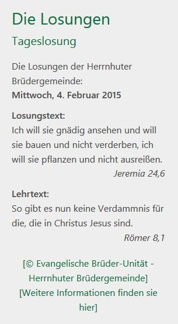

.. ==================================================
.. FOR YOUR INFORMATION
.. --------------------------------------------------
.. -*- coding: utf-8 -*- with BOM.

.. include:: ../../Includes.txt

.. _introduction:

Einführung
==========

.. _what-it-does:

Was tut es?
----------------

Diese Erweiterung fügt ein neues Frontend-Plugin für die deutschen Losungen hinzu.
Wichtig: Die Erweiterung zeigt nur Losungen von der offiziellen Homepage der Brüdergemeinde Hernnhut (www.losungen.de).
Die aktuellen Losungen werden jährlich von der obigen Seite heruntergeladen, kein manueller Eingriff ist nötig für diesen Prozess. Die Erweiterung nutzt das temporäre Verzeichnis von TYPO3 um alle heruntergeladenen Dateien zu speichern.

.. _screenshots:

Screenshots
-----------

Hier sehen sie ein Beispiel:

   Abbildung 1: Losung Beispiel - http://efg-belzig.de, 04.02.2015
